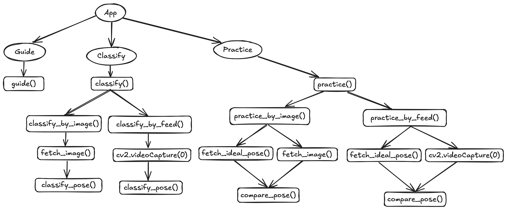

# YogaBuddy - AI Yoga Assistant

YogaBuddy is an AI-powered yoga assistant designed to help users practice Sun Salutation poses effectively. Built using Streamlit, it offers pose guidance, pose classification, and real-time feedback, leveraging image-based and keypoint-based models for accuracy.

## Table of Contents

- [Overview](#overview)
- [Getting Started](#getting-started)
- [Model Overview](#model-overview)
- [Model Details](#model-details)
- [Dependencies](#dependencies)
- [Future Enhancements](#future-enhancements)
- [Contributions](#contributions)

## Overview

YogaBuddy is a user-friendly assistant focused on the Sun Salutation (Surya Namaskar) sequence of yoga poses. It offers three main functionalities:

1. **Guide**: Visual and textual guidance for Sun Salutation poses, perfect for beginners.
2. **Classify**: Classifies uploaded or live camera images into specific Sun Salutation poses.
3. **Practice**: Provides angle-based feedback to help users improve their yoga pose alignment.

## Getting Started

1. **Clone the repository**:
    ```bash
    git clone https://github.com/dilkushsingh/YogaBuddy.git
    cd YogaBuddy
    ```

2. **Create a virtual environment**:
    ```bash
    python3 -m venv myenv
    source myenv/bin/activate   # On Windows use: myenv\Scripts\activate
    ```

3. **Install dependencies**:
    ```bash
    pip install -r requirements.txt
    ```

4. **Download data and models**:
    - Data: [YogaBuddy Dataset on Kaggle](https://www.kaggle.com/datasets/dilkushsingh/yogabuddy-data)
    - Models: [YogaBuddy Models on Hugging Face](https://huggingface.co/dilkushsingh/YogaBuddy-models)
    - Place the downloaded data in the `data` folder and the models in the `models` folder as follows:
        ```
        YogaBuddy/
        ├── data/
        │   ├── <dataset_files>
        ├── models/
        │   ├── <model_files>
        ```

5. **Run the Streamlit app**:
    ```bash
    streamlit run app.py
    ```

## Model Overview

Below is a flowchart diagram of the YogaBuddy system pipeline:



## Model Details

### Classification Models

YogaBuddy integrates multiple models trained on pose data, including:

- **Image-based Neural Network**: Built using TensorFlow, trained on pose images for classification.
- **Keypoint-based Neural Network**: Classifies poses using extracted body keypoints.
- **Keypoint-based KNN**: Identifies poses based on proximity in keypoint feature space (using `sklearn` library).
- **Keypoint-based XGBoost Classifier**: Uses keypoint data with a boosted algorithm for pose classification.

*For the Streamlit app, YogaBuddy uses the XGBoost classifier for real-time and reliable pose classification.*

### Keypoint Detection

MediaPipe is used for real-time keypoint detection, which supports both classification and angle-based feedback. This enables precise evaluation and alignment correction for users practicing poses.

## Dependencies

- [Streamlit](https://streamlit.io/) - App interface development.
- [OpenCV](https://opencv.org/) - Image and video processing.
- [MediaPipe](https://mediapipe.dev/) - Keypoint detection.
- [TensorFlow](https://www.tensorflow.org/) - For training image-based models.
- [XGBoost](https://xgboost.ai/) - For real-time pose classification in the app.
- [scikit-learn (sklearn)](https://scikit-learn.org/stable/) - For KNN-based pose classification.
- Refer to `requirements.txt` for the complete list of dependencies.

## Future Enhancements

- Integrate a fine-tuned large language model (LLM) to provide additional yoga-related knowledge and insights.
- Add voice-based real-time instructions for pose correction.
- Include advanced yoga poses and sequences.
- Develop detailed body-part-specific error analysis during practice.

## Contributions

Contributions are welcome to make YogaBuddy more robust and versatile.
We encourage contributions in the following areas:
- Adding advanced yoga poses or sequences.
- Improving pose correction accuracy.
- Enhancing the user interface for better engagement.